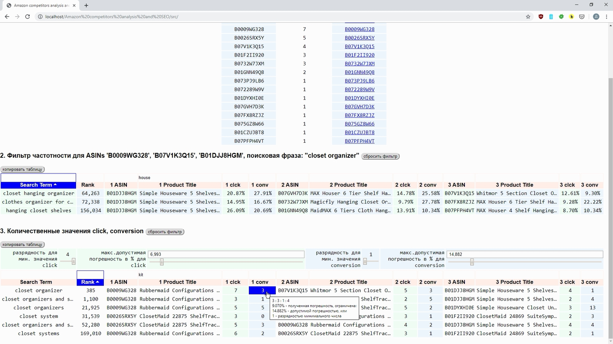

# Amazon-analysis
Analysis tool for Amazon sales. Amazon competitors analysis and SEO analysis 

Video:

## Overview
Analysis tool for Amazon sales. Amazon competitors analysis and SEO analysis. 

## Table of contents
- [Overview](#Overview)
- [Description](#Description)
- [Communication](#Communication)
- [Credits](#Credits)
- [License](#License)

## Description
For commercial security, only the first three steps for analysis are shown. 

## Communication
If you have any questions or suggestions for this project, please [file an issue](https://github.com/Nickieros/Amazon-analysis/issues). For other questions [contact me](https://github.com/Nickieros).

## Credits
2019 [Nickieros](https://github.com/Nickieros)

## License
MIT
