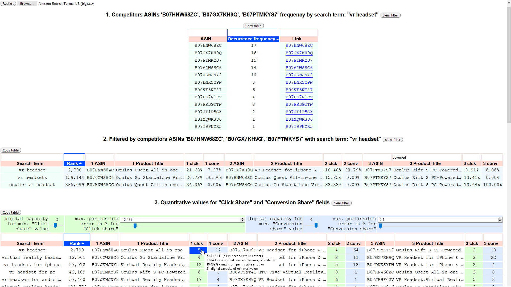

# Amazon-analysis
Analysis tool for Amazon sales.

Video:

## Overview
Analysis tool for Amazon sales. Competitors, SEO and quantitative analysis. 

## Table of contents
- [Overview](#Overview)
- [Description](#Description)
- [Communication](#Communication)
- [Credits](#Credits)
- [License](#License)

## Description
This tool use "Amazon Search Term Report" exported in "csv" format.
 After loading and rendering report table, the desired product for analysis can selected by clicking on its row.
 When the product row chosen, 3 table become available:
 1. Products competitors with its occurrence frequency in the report's search phrase
 2. Report's table that filtered by product competitors
 3. The same as above, with quantitative values tuning for "Click Share" and "Conversion Share" fields. The tuning is made by changing the digital capacity or permissible error for  minimum value in the row. A decrease in the quantitative value for a more visual representation, as a rule, is accompanied by an increase in the calculation error. Detailed information on the quantitative value is in its tooltip (see screenshot)
 
You can watch the video how it works:
https://youtu.be/SxoRe1EL3Wc

- Time to render a report table depends on the report size. 20,000 rows can processed in 5...40 seconds depending on the CPU performance.
- For commercial security, only the first three steps for analysis are shown.

## Communication
If you have any questions or suggestions for this project, please [file an issue](https://github.com/Nickieros/Amazon-analysis/issues). For other questions [contact me](https://github.com/Nickieros).

## Credits
2019 [Nickieros](https://github.com/Nickieros)

## License
MIT
